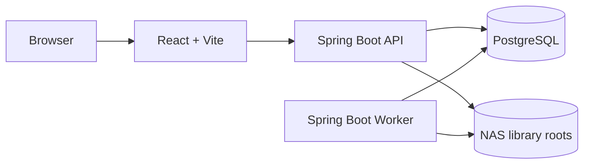

<div align="center">

# BookKin

**Our books, together.**

An open-source, self-hosted family library and personal book collection manager for EPUB and PDF.

开源、自托管的家庭电子书库与个人藏书管理平台，让家人的书籍、阅读进度与私人笔记各得其所。

[](https://github.com/johntao2004/BookKin/actions/workflows/docker.yml)
[](LICENSE)
[](apps/server/pom.xml)
[](apps/web/package.json)
[](#what-bookkin-does)

</div>

BookKin turns a NAS folder into a private digital bookshelf for a household. It combines book cataloging, browser-based reading, multi-user privacy, and carefully controlled file operations in one deployable system. The name joins **Book + Kin**: books shared with the people closest to you.

## What BookKin does

| Area | Capabilities |
| --- | --- |
| Library | EPUB/PDF catalog, metadata and cover management, categories, booklists, search, cursor pagination, large-catalog tooling |
| Reading | EPUB.js and PDF.js readers, reading positions, bookmarks, highlights, underlines, bold marks, notes, custom fonts and whole-site themes |
| Family accounts | Owner, administrator and member roles; private per-user progress and annotations; controlled public discovery |
| NAS safety | Incremental scans, path validation, fingerprints, previews, idempotency keys, file leases, recycle bin and audited recovery paths |
| Ingestion | Streaming uploads, duplicate SHA-256 checks, local metadata extraction, optional online enrichment and manual review before placement |
| Deployment | React 19 web app, Java 21 modular monolith, separate API/Worker profiles, PostgreSQL 18 and Docker Compose |

BookKin V1 intentionally focuses on EPUB and PDF. It does not include open registration, email, OAuth, MFA, OCR, audiobooks or comics.

## Architecture



The API and Worker come from the same modular-monolith artifact. Long-running scans and file transactions stay outside HTTP request threads, while PostgreSQL stores accounts and catalog state and the NAS remains the source of truth for book files.

## Quick start

### Requirements

- Node.js 22+
- pnpm 10+
- Java 21
- PostgreSQL 18

### Local development

Create the local database once:

```bash
brew install postgresql@18
brew services start postgresql@18
createuser --login bookkin
createdb --owner=bookkin bookkin
psql postgres -c "alter role bookkin password 'bookkin-local-dev'"
```

Install dependencies and create the local cover-complete demo library. The default sample contains four books with four distinct polished covers; it does not seed reading activity, annotations, or text-only PDF placeholders:

```bash
pnpm install
pnpm demo:library
```

Run the API and Worker, then start the web app in another terminal:

```bash
pnpm start:local
pnpm dev
```

Open `http://localhost:4173/setup` to create the owner account. After setup, `pnpm demo:seed` can populate the PostgreSQL-backed demo state.

`pnpm start:local` builds the backend and runs immutable JAR snapshots from `.local/run`, so a later Maven build cannot replace archives already being read by the JVM.

### Docker Compose

```bash
cp .env.example .env
# Set a strong POSTGRES_PASSWORD in .env
docker compose up --build
```

For production, expose BookKin only through a trusted LAN or VPN and mount the intended NAS directory explicitly.

## Safety and privacy

- Reading positions, bookmarks, highlights and notes are isolated by user and are not visible to owners or administrators by default.
- Members cannot modify original NAS files. Owner/admin writes require a preview, expected fingerprint and idempotency key; permanent cleanup is owner-only.
- Uploads stream into `.bookkin-staging/uploads` and enter the formal library only after parsing and confirmation.
- Cross-root moves use staging, fsync, SHA-256 verification, parse validation and recoverable source placement.
- Book files, upload staging data and cover binaries stay on disk rather than in PostgreSQL.

## Repository map

```text
apps/web/       React, TypeScript, Vite and Material UI
apps/server/    Java 21, Spring Boot, Flyway and jOOQ
design/         Design tokens and Figma scope
docs/           Architecture, operations, ADRs and OpenAPI
docker/         Production image and multi-root example
ops/            Backup and restore utilities
scripts/        Local runtime, demo data and token generation
```

## Quality gates

```bash
pnpm lint
pnpm typecheck
pnpm test
pnpm build

cd apps/server
./mvnw verify
```

The design-token source of truth is [`design/tokens.json`](design/tokens.json). After changing it, run `pnpm generate:tokens` and review the corresponding Figma variables.

## Documentation

- [Technical architecture](docs/technical-architecture.md)
- [Design system](docs/design-system.md)
- [Implementation status](docs/implementation-status.md)
- [Operations runbook](docs/operations-runbook.md)
- [OpenAPI contract](docs/openapi/bookkin-api.yaml)
- [Architecture decisions](docs/adr)
- [Multi-root Compose example](docker/compose.multi-root.example.yaml)

## License

BookKin is available under the [MIT License](LICENSE).
