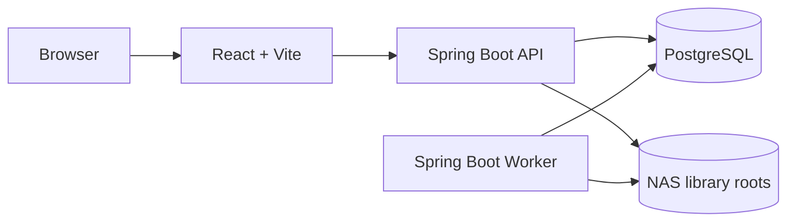

<div align="center">

# BookKin

**Our books, together.**

An open-source, self-hosted family library and personal book collection manager for EPUB and PDF.

开源、自托管的家庭电子书库与个人藏书管理平台，让家人的书籍、阅读进度与私人笔记各得其所。

[](https://github.com/johntao2004/BookKin/actions/workflows/docker.yml)
[](LICENSE)
[](apps/server/pom.xml)
[](apps/web/package.json)
[](#what-bookkin-does)

</div>

BookKin turns a NAS folder into a private digital bookshelf for a household. It combines book cataloging, browser-based reading, multi-user privacy, and carefully controlled file operations in one deployable system. The name joins **Book + Kin**: books shared with the people closest to you.

## What BookKin does

| Area | Capabilities |
| --- | --- |
| Library | EPUB/PDF catalog, metadata and cover management, categories, booklists, search, cursor pagination, large-catalog tooling |
| Virtual library | Original Gothic rotunda, real catalog books, shelf inspection, celestial catalog search and separate archive/office rooms |
| Reading | EPUB.js and PDF.js readers, reading positions, bookmarks, highlights, underlines, bold marks, notes, custom fonts and whole-site themes |
| Family accounts | Owner, administrator and member roles; private per-user progress and annotations; controlled public discovery |
| NAS safety | Incremental scans, path validation, fingerprints, previews, idempotency keys, file leases, recycle bin and audited recovery paths |
| Ingestion | Streaming uploads, duplicate SHA-256 checks, local metadata extraction, optional online enrichment and manual review before placement |
| Deployment | React 19 web app, Java 21 modular monolith, separate API/Worker profiles, PostgreSQL 18 and Docker Compose |

BookKin V1 intentionally focuses on EPUB and PDF. It does not include open registration, email, OAuth, MFA, OCR, audiobooks or comics.

## Architecture



The API and Worker come from the same modular-monolith artifact. Long-running scans and file transactions stay outside HTTP request threads, while PostgreSQL stores accounts and catalog state and the NAS remains the source of truth for book files.

## Quick start

### Requirements

- Node.js 22+
- pnpm 10+
- Java 21
- PostgreSQL 18

### Local development

Create the local database once:

```bash
brew install postgresql@18
brew services start postgresql@18
createuser --login bookkin
createdb --owner=bookkin bookkin
psql postgres -c "alter role bookkin password 'bookkin-local-dev'"
```

Install dependencies and create the local cover-complete demo library. The default sample contains four books with four distinct polished covers; it does not seed reading activity, annotations, or text-only PDF placeholders:

```bash
pnpm install
pnpm demo:library
```

Start the complete local preview in the background (API, Worker and web):

```bash
pnpm start:preview
pnpm status:preview
# Stop processes created by this launcher:
pnpm stop:preview
```

The launcher waits for API health and the web CSRF proxy, reuses healthy services, and detaches newly started processes from the terminal. Logs are in `.local/logs/`. Closing the terminal does not stop the preview. It does not install a system service or start automatically after a reboot. Already running services reused by this launcher remain under their original owner; stop those through their original launcher.

For foreground debugging, `pnpm start:local` and `pnpm dev` remain available in separate terminals; closing either terminal stops that part of the stack.

Open `http://localhost:4173/setup` to create the owner account. After setup, `pnpm demo:seed` can populate the PostgreSQL-backed demo state.

`pnpm start:local` builds the backend and runs immutable JAR snapshots from `.local/run`, so a later Maven build cannot replace archives already being read by the JVM.

### Docker Compose

```bash
cp .env.example .env
# Set a strong POSTGRES_PASSWORD in .env
docker compose up --build
```

For production, expose BookKin only through a trusted LAN or VPN and mount the intended NAS directory explicitly.

## Safety and privacy

- Reading positions, bookmarks, highlights and notes are isolated by user and are not visible to owners or administrators by default.
- Members cannot modify original NAS files. Owner/admin writes require a preview, expected fingerprint and idempotency key; permanent cleanup is owner-only.
- Uploads stream into `.bookkin-staging/uploads` and enter the formal library only after parsing and confirmation.
- Cross-root moves use staging, fsync, SHA-256 verification, parse validation and recoverable source placement.
- Book files, upload staging data and cover binaries stay on disk rather than in PostgreSQL.

## Repository map

```text
apps/web/       前端：React、TypeScript、Vite、Ant Design
apps/server/    后端：Java 21、Spring Boot、Flyway、jOOQ
design/         Design tokens, Figma scope and dated visual QA
docs/           Architecture, operations, ADRs and OpenAPI
docker/         Production image and multi-root example
ops/            Backup and restore utilities
scripts/        开发脚本：本地启动、演示数据、Token 生成
scripts/benchmark/  性能测试脚本与专用 SQL
```

完整代码位置及文件存放规则见 [目录导航](docs/repository-layout.md)。

## Quality gates

```bash
pnpm lint
pnpm typecheck
pnpm test
pnpm build

cd apps/server
./mvnw verify
```

The design-token source of truth is [`design/tokens.json`](design/tokens.json). After changing it, run `pnpm generate:tokens` and review the corresponding Figma variables.

## Documentation

- [Repository layout](docs/repository-layout.md)
- [Virtual library](docs/virtual-library.md)
- [Documentation audit](docs/documentation-audit.md)
- [Technical architecture](docs/technical-architecture.md)
- [Design system](docs/design-system.md)
- [Implementation status](docs/implementation-status.md)
- [Operations runbook](docs/operations-runbook.md)
- [OpenAPI contract](docs/openapi/bookkin-api.yaml)
- [Architecture decisions](docs/adr)
- [Multi-root Compose example](docker/compose.multi-root.example.yaml)

## License

BookKin source code is available under the [MIT License](LICENSE). Bundled fonts, artwork and models retain their own licenses and source notices in `apps/web/public/`; see [font sources](apps/web/public/fonts/FONT_SOURCES.md) and [virtual-library assets](docs/virtual-library.md#资源与许可).

### 邮件与密码找回

主人在「设置 → 邮件服务」填写 SMTP 主机、端口、连接加密、用户名、授权码、发件邮箱和 BookKin 站点地址，启用并保存后向自己的邮箱发送测试邮件。支持 STARTTLS（通常 587）与 TLS（通常 465）；不加密模式只允许本机测试。授权码加密存储，留空保存会保留原值。使用实例已有的 `BOOKKIN_AI_SETTINGS_ENCRYPTION_KEY`，部署后需持续保留此密钥。

用户在「设置 → 找回邮箱」输入当前密码和邮箱，通过邮件中的链接确认绑定。登录页「忘记密码？」向已验证邮箱发送 30 分钟有效的一次性链接；重置成功撤销旧会话，需要重新登录。不存在或停用的账户使用相同申请响应。发送失败可由主人通过测试邮件检查 SMTP 配置，服务端记录重置投递失败审计。

邮件中的站点地址必须为可访问的 HTTPS 根地址；本机测试可使用 `http://127.0.0.1:4175`。`BOOKKIN_WEB_PORT=4175 pnpm start:preview` 可选择空闲的本地端口，成功启动后会记住该端口供后续启动和状态检查使用。用户仍处于临时密码状态时，需要先设置自己的密码才能管理邮件配置或绑定邮箱。

### 密码复杂度

主人可在「用户管理 → 安全设置 → 密码复杂度」配置最小长度（8–128）以及大写字母、小写字母、数字、英文标点/符号要求。默认延续至少 12 位；密码最多 200 位。注册、主人初始化、首次改密与邮件重置共享服务端校验和页面提示。自动临时密码满足当前规则。规则变更只影响新设置的密码，不会阻止已有密码登录。密码规则与开放注册分别保存。
